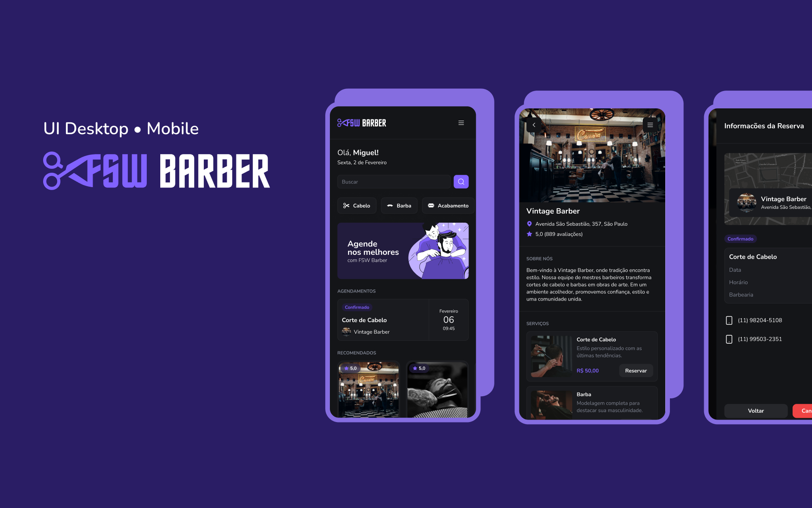

# Barber App



Aplicação web para agendamento de horários em barbearias. O usuário pode pesquisar barbearias, visualizar seus serviços, autenticar-se com sua conta Google e reservar um horário para o serviço desejado, além de acompanhar e cancelar seus agendamentos.

## Sobre o projeto

O Barber App simula uma plataforma de marketplace de barbearias, no estilo de apps de agendamento de serviços. A proposta é permitir que o usuário final:

- Explore barbearias recomendadas e populares na tela inicial.
- Busque barbearias por nome.
- Veja detalhes de uma barbearia (endereço, telefones, descrição e serviços oferecidos).
- Faça login com sua conta Google.
- Escolha um serviço, selecione data e horário disponíveis e confirme o agendamento.
- Acompanhe seus agendamentos confirmados e finalizados na área "Agendamentos".
- Cancele um agendamento existente.

O projeto foi construído como uma aplicação full-stack utilizando o App Router do Next.js, com renderização no servidor (Server Components e Server Actions) para busca de dados e mutações, e Prisma como camada de acesso ao banco de dados PostgreSQL.

## Stack tecnológica

- **Framework:** Next.js 16 (App Router, Server Components e Server Actions)
- **Linguagem:** TypeScript
- **UI:** React 19, Tailwind CSS 4, componentes baseados em Base UI / shadcn
- **Ícones:** Lucide React
- **Formulários e validação:** React Hook Form + Zod
- **Autenticação:** NextAuth com provedor Google e adapter Prisma
- **Banco de dados:** PostgreSQL, acessado via Prisma ORM (driver adapter `@prisma/adapter-pg`)
- **Datas:** date-fns e React Day Picker
- **Notificações:** Sonner
- **Qualidade de código:** ESLint, Prettier, Husky e lint-staged

## Modelo de dados

O schema Prisma (`prisma/schema.prisma`) define as seguintes entidades principais:

- `User`, `Account`, `Session` e `VerificationToken`: modelos padrão utilizados pelo NextAuth para autenticação.
- `Barbershop`: representa uma barbearia (nome, endereço, telefones, descrição e imagem).
- `BarbershopService`: um serviço oferecido por uma barbearia (nome, descrição, preço e imagem), relacionado a uma `Barbershop`.
- `Booking`: um agendamento feito por um `User` para um `BarbershopService` em uma data específica.

## Estrutura do projeto

```text
app/
  _actions/        Server Actions (criação e cancelamento de agendamentos)
  _components/     Componentes de UI compartilhados (Header, Menu, cards, etc.)
  _components/ui/  Componentes de UI reutilizáveis (botões, inputs, dialogs, etc.)
  _lib/             Configuração de autenticação, cliente do Prisma e utilitários
  _providers/       Providers globais (sessão de autenticação)
  api/auth/         Rota de autenticação do NextAuth
  barbershops/      Listagem e página de detalhes de uma barbearia
  bookings/         Página de agendamentos do usuário
  page.tsx          Página inicial
prisma/
  schema.prisma     Definição do banco de dados
  seed.ts           Script de seed do banco
public/             Imagens e ícones estáticos
```

## Como executar o projeto

Link direto: https://barber-app-rust-theta.vercel.app/

### Pré-requisitos

- Node.js
- Uma instância PostgreSQL acessível
- Credenciais OAuth do Google (Client ID e Client Secret)

### Variáveis de ambiente

Crie um arquivo `.env` na raiz do projeto com as seguintes variáveis:

```text
DATABASE_URL=
GOOGLE_CLIENT_ID=
GOOGLE_CLIENT_SECRET=
NEXTAUTH_SECRET=
NEXTAUTH_URL=
```

### Instalação e execução

```bash
# instalar dependências
npm install

# aplicar o schema do Prisma no banco de dados
npx prisma db push

# (opcional) popular o banco com dados de exemplo
npx prisma db seed

# iniciar o servidor de desenvolvimento
npm run dev
```

A aplicação estará disponível em [http://localhost:3000](http://localhost:3000).

### Scripts disponíveis

| Script          | Descrição                                           |
| --------------- | --------------------------------------------------- |
| `npm run dev`   | Inicia o servidor de desenvolvimento                |
| `npm run build` | Gera o cliente do Prisma e cria o build de produção |
| `npm run start` | Inicia o servidor com o build de produção           |
| `npm run lint`  | Executa o ESLint sobre o código                     |

## Observação sobre a versão do Next.js

Este projeto utiliza uma versão do Next.js com mudanças significativas em relação às versões mais difundidas (APIs, convenções e estrutura de arquivos podem diferir do que é normalmente encontrado em documentações e tutoriais). Antes de alterar código relacionado ao framework, consulte a documentação incluída em `node_modules/next/dist/docs/`.
